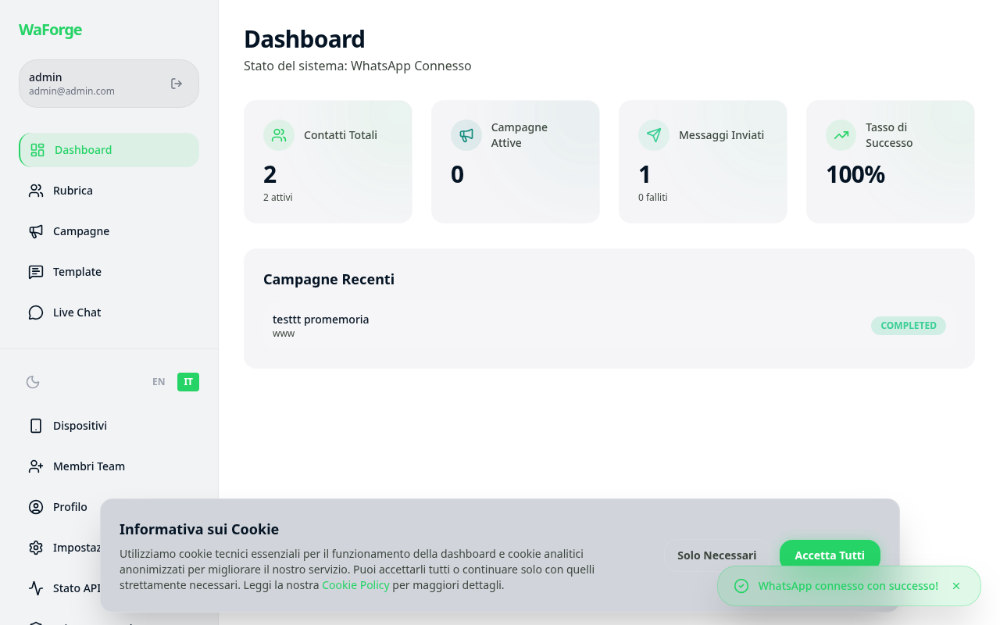
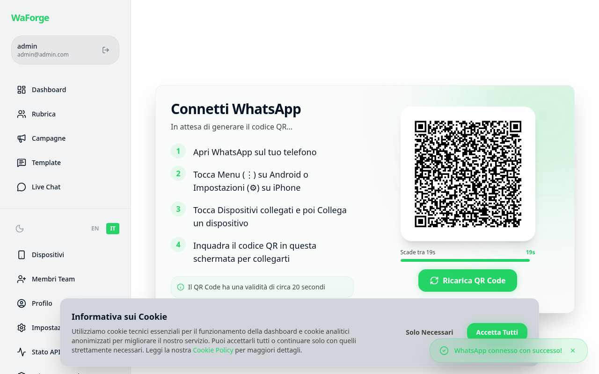
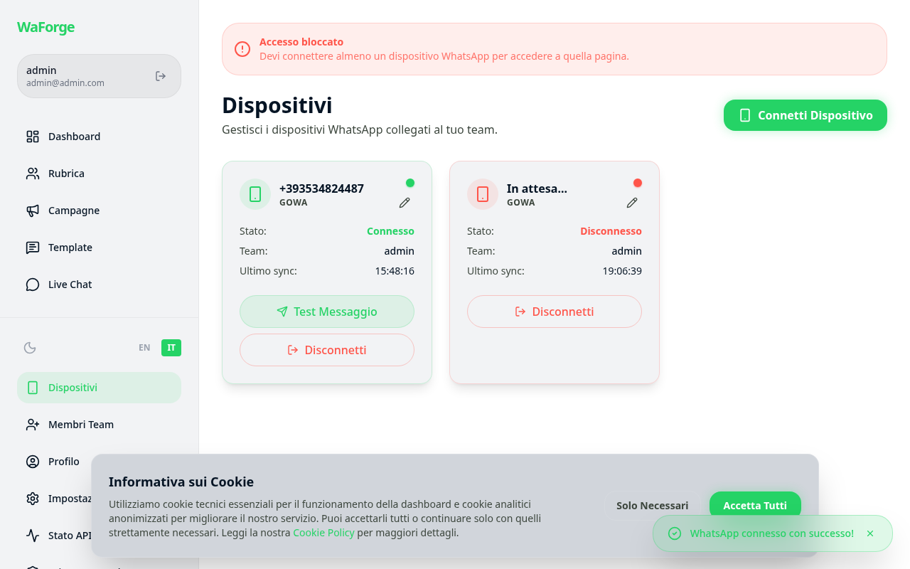
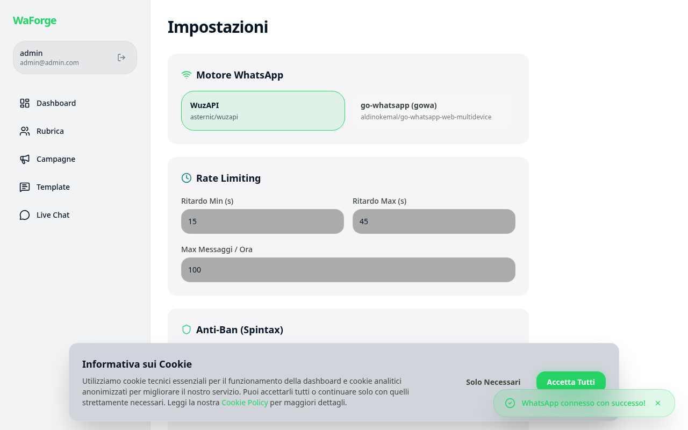
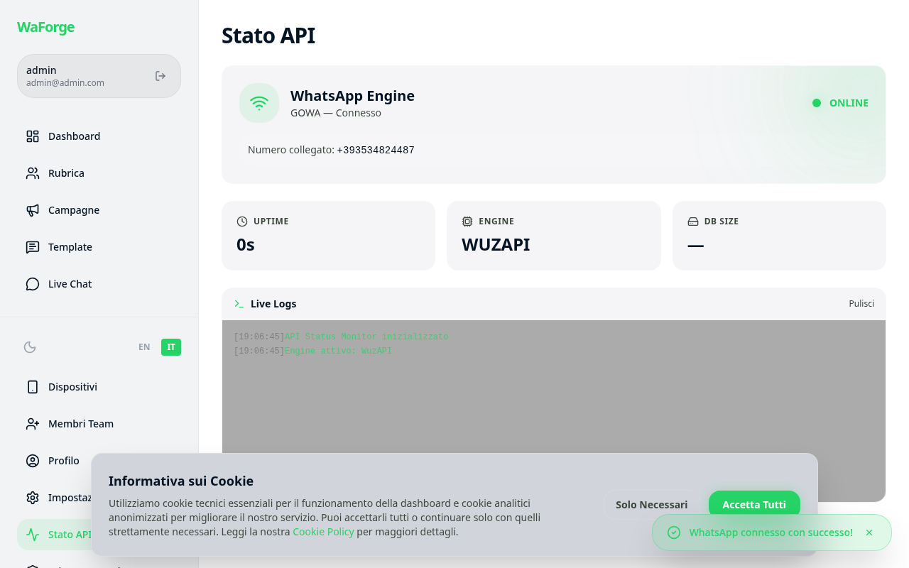

<p align="center">
  
</p>

<h1 align="center">WaForge</h1>

<p align="center">
  <strong>Premium dashboard for mass and personalized WhatsApp messaging.</strong>
  <br/>
  Designed with a modern, secure, and scalable architecture.
</p>

<p align="center">
  <a href="README.it.md">🇮🇹 Leggi in Italiano</a> | <a href="README.md">🇬🇧 English</a>
</p>

**WaForge** is the ultimate open-source solution for WhatsApp marketing automation, bulk messaging, and CRM integration. Built on Nuxt 3 and Prisma, it offers enterprise-grade features like dynamic spintax generation, AI-powered anti-ban strategies, and zero-width character obfuscation to ensure your WhatsApp outreach is scalable, secure, and compliant.
<p align="center">
  
  
  
  
  
  
</p>

<p align="center">
  
  
  
  
</p>

---

## 📸 Screenshots

> UI designed with **Google Stitch** — "Pro Connect" Design System (Glassmorphism, native Dark Mode, WhatsApp Green palette).

| Dashboard | QR Connection |
|:---------:|:--------------:|
|  |  |

| Contacts Management | Campaigns |
|:-----------------:|:--------:|
|  |  |

| Settings | API Status Monitor |
|:------------:|:------------------:|
|  |  |

---

## ✨ Key Features

- **Contact Segmentation (Rubriche):** Group and organize contacts into custom categories (groups) to target specific audiences for different campaign purposes.
- **Improved Campaign Wizard:** A 4-step wizard UI (Details, Template, Target, Pre-flight Summary) ensuring zero mistakes before sending.
- **Dynamic Spintax Preview:** Test and regenerate spintax variations (e.g., `{Hello|Hi}`) in real-time directly inside the wizard.
- **Real-Time Progress (SSE):** Monitor campaign delivery status instantly via Server-Sent Events (SSE) with minimal server load.
- **BullMQ Auto-Cleanup:** Automated queue garbage collection to keep Redis database footprint light.
- **Multi-Tenant & Anti-Ban:** Complete isolation between teams and rigorous evasion mechanisms (Zero-width chars, Gaussian jitter, simulation typing, etc.) built-in.
- **GDPR Consent Management:** Native opt-in/opt-out tracking to strictly enforce privacy policies and stop unsolicited messages automatically.
- **AI-Powered Copywriting:** Generate spintax variants and optimize message content automatically through LLM integration.
- **Bulk Operations & Real-Time Stats:** Perform bulk selections, deletions, and monitor campaign progression (read/delivered statuses) live via Webhooks.
- **🔌 Cockpit Tools Proxy Support:** Native integration with [Cockpit Tools](https://github.com/jlcodes99/cockpit-tools) for automatic discovery and shared use of AI accounts, optimizing costs and API limits.
- **🧠 Smart MCP Routing (Agent Tools):** MCP (Model Context Protocol) services and the Cockpit proxy are two independent architectural layers. To prevent token "drain" (sending the entire tool documentation to the LLM on every single message) and reduce latency, WaForge activates MCP servers **only when needed**.
  - **How to force activation?** The engine loads MCP processes only if you use specific keywords in your prompt (e.g., *"Use **tools** to read this file"*, or including words like *strument*, *mcp*) or if the base tool is vital. This triggers the filter bypass and runs MCP alongside the Cockpit proxy, guaranteeing maximum performance.

- **💰 Built-in SaaS Monetization (Stripe):** WaForge includes a native SaaS billing engine powered by Stripe Checkout and Customer Portal. It natively supports the most modern payment methods (Apple Pay, Google Pay, PayPal, Klarna, Crypto USDC) dynamically activated via the Stripe Dashboard without writing extra code. Role-Based Access Control (RBAC) automatically enforces plan limits (Free, Pro, Enterprise) on WhatsApp devices, contacts, and campaigns.

---

## 🚀 Tech Stack

| Layer | Technology | Notes |
|-------|-----------|------|
| **Framework** | [Nuxt 3](https://nuxt.com) (Nitro Engine) | SSR, API Routes, Auto-imports |
| **UI** | [Vue 3](https://vuejs.org) + Composition API | `<script setup>`, Pinia state |
| **Runtime** | [Bun](https://bun.sh) | Ultra-fast JS runtime & package manager |
| **Styling** | [Tailwind CSS](https://tailwindcss.com) | Design System "Pro Connect" from Stitch |
| **ORM** | [Prisma](https://prisma.io) + PostgreSQL | Typesafe, portable DB interactions |
| **WhatsApp** | Dual Engine (WuzAPI / gowa) | Based on whatsmeow, Multi-Device API |
| **Skeleton** | [phantom-ui](https://github.com/Aejkatappaja/phantom-ui) | Web Component skeleton loaders |
| **i18n** | @nuxtjs/i18n | Italiano / English |
| **Icons** | [Lucide Vue](https://lucide.dev) | 1400+ optimized SVG icons |
| **Auth** | JWT + OAuth2 | Standard login + SSO (e.g. PocketID) |

### 🔌 Supported WhatsApp Engines

The project supports **two interchangeable WhatsApp backends** via the `WHATSAPP_ENGINE` environment variable:

| Engine | Repository | Protocol | Default |
|--------|-----------|------------|---------|
| **WuzAPI** | [asternic/wuzapi](https://github.com/asternic/wuzapi) | REST API on whatsmeow | ✅ Primary |
| **gowa** | [aldinokemal/go-whatsapp-web-multidevice](https://github.com/aldinokemal/go-whatsapp-web-multidevice) | REST API on whatsmeow | Fallback |

Both eliminate the browser/Selenium dependency — they communicate directly via the WhatsApp Web Multi-Device protocol.

---

## 🏗️ Architecture

```
┌─────────────────────────────────────────────────────────────┐
│                    Browser (Vue 3 SPA)                       │
│  ┌──────────┐  ┌──────────┐  ┌──────────┐  ┌────────────┐  │
│  │Dashboard │  │ Contacts │  │Campaigns │  │  Settings  │  │
│  └────┬─────┘  └────┬─────┘  └────┬─────┘  └─────┬──────┘  │
│       └──────────────┼────────────┼───────────────┘         │
│                      ▼            ▼                          │
│              Pinia State Management                          │
└──────────────────────┬──────────────────────────────────────┘
                       │ HTTP/JSON
┌──────────────────────▼──────────────────────────────────────┐
│                  Nitro Server Engine                          │
│  ┌─────────────┐  ┌──────────────┐  ┌────────────────────┐  │
│  │  API Routes  │  │  Middleware   │  │   Job Queue        │  │
│  │  /api/*      │  │  Rate Limit  │  │   (Async Sender)   │  │
│  │  Zod Valid.  │  │  Auth/CORS   │  │   Spintax + Jitter │  │
│  └──────┬───────┘  └──────────────┘  └─────────┬──────────┘  │
│         │                                       │             │
│  ┌──────▼───────┐                      ┌───────▼──────────┐  │
│  │ Prisma ORM   │                      │ WhatsApp Engine  │  │
│  │ (PostgreSQL) │                      │ (WuzAPI / gowa)  │  │
│  └──────────────┘                      └──────────────────┘  │
└──────────────────────────────────────────────────────────────┘
                                                │
                                    ┌───────────▼────────────┐
                                    │   WhatsApp Multi-Device │
                                    │   (whatsmeow protocol)  │
                                    └────────────────────────┘
```

---

## 🔒 Security (Secure by Design)

The project rigorously implements **OWASP Top 10** and **NIST CSF 2.0** guidelines:

| OWASP | Protection | Implementation |
|-------|-----------|-----------------|
| **A01** | Broken Access Control | Auth middleware, API key validation on `/api/*` |
| **A02** | Cryptographic Failures | Secrets not exposed, HTTPS policy (HSTS) |
| **A03** | Injection | Prisma ORM (no raw SQL), Zod validation, XSS tag stripping, SSTI prevention |
| **A04** | Insecure Design | Rate limiting middleware, anti-ban jitter |
| **A05** | Security Misconfiguration | CSP, X-Frame-Options, no-sniff, `X-Powered-By` disabled |
| **A09** | Security Logging | Structured NIST CSF 2.0 logger, audit trail for auth and injection |

---

## 🛡️ Anti-Ban Protection (Meta Anti-Fraud Evasion)

WaForge includes an advanced, built-in **Anti-Ban Evasion Shield** to prevent Meta anti-fraud triggers (such as `403 Device fingerprint mismatch` or `Too many requests`). These mechanisms mimic organic human behaviors and randomize signals:

- **Zero-Width Character Randomization:** Automatically appends a unique, dynamic combination of 3 to 8 invisible zero-width characters (`\u200B`, `\u200C`, `\u200D`, `\uFEFF`) to the end of every message. This ensures Meta sees a completely unique text hash for each message, breaking duplicate content detection without affecting user experience.
- **Gaussian Jitter Scheduling:** Queue delays are mathematically randomized using the Box-Muller transform (normal/Gaussian distribution) instead of a predictable uniform timer, simulating human variation.
- **Typing Simulation:** Simulates the `"typing..."` (`composing`) presence indicator before sending, with a dynamic waiting duration proportional to the message length (~30ms per character).
- **Auto-Pause Emergency Stop:** Instantly pauses all active campaigns if the system detects error logs containing ban indicators (e.g., `403`, `fingerprint`, `blocked`, `too many`, `invalid device`) to prevent account termination.
- **Daily Send Cap & Business Hours Guard:** Automatically enforces a custom daily cap per team and schedules messages exclusively during active hours (07:00 – 22:00 UTC) to bypass off-hour anomalies.
- **Strict Concurrency Pacing:** Limits the BullMQ background worker to a concurrency of `1` message per queue to prevent sudden spikes or bursts.
- **Contact Integrity Check:** Automatically skips phone numbers already flagged as invalid (`isOnWhatsApp === false`) to protect domain reputation.

---

## 📁 Project Structure

```
waforge/
├── pages/               # Vue Pages (file-based routing)
├── components/          # Reusable Vue Components
├── layouts/             # Sidebar Layout + Theme/i18n
├── stores/              # Pinia State Management
├── lib/                 # Core utilities
│   ├── whatsapp-engine.ts   # Dual engine abstraction
│   ├── wuzapi.ts            # WuzAPI Client
│   ├── csv-parser.ts        # CSV/Excel parser
│   ├── validation.ts        # Zod schemas (OWASP A03)
│   ├── security-logger.ts   # Audit logger (NIST CSF 2.0)
│   └── spintax.ts           # Spintax engine (anti-ban)
├── server/              # Nitro API Routes
│   ├── api/             # REST endpoints
│   ├── middleware/       # Rate limit, auth, headers
│   └── utils/           # Prisma, job queue, helpers
├── prisma/              # DB Schema + migrations
├── locales/             # i18n (it.json, en.json)
├── docs/screenshots/    # UI Screenshots (Google Stitch)
├── Dockerfile           # Production Build (Nitro)
└── docker-compose.yml   # Multi-container orchestration
```

---

## 🛠️ Quick Start

### Prerequisites

- [Bun](https://bun.sh) >= 1.1
- [Docker](https://docker.com) (for WuzAPI/gowa)

### Installation

```bash
# 1. Clone the repository
git clone https://github.com/darkrei08/waforge.git
cd waforge

# 2. Install dependencies
bun install

# 3. Configure the environment
cp .env.example .env
# Edit .env with your values (APP_SECRET, WUZAPI_TOKEN, etc.)

# 4. Initialize the database
bun run db:push

# 5. Start WuzAPI via Docker
docker-compose -f docker-compose.dev.yml up -d

# 6. Start the dev server
bun run dev
```

Open [http://localhost:3000](http://localhost:3000) in your browser.

### 🐳 Docker (Production)

Three options for deployment:

#### Option 1 — Pre-built image from GitHub Container Registry

The image is available on `ghcr.io` and updates automatically on each release:

```bash
# Pull the image
docker pull ghcr.io/darkrei08/waforge:latest

# Direct start (app only, WuzAPI separate)
docker run -d \
  --name waforge \
  -p 3000:3000 \
  -e WUZAPI_URL=http://host.docker.internal:3100 \
  -e WUZAPI_TOKEN=your-token \
  -e APP_SECRET=your-secret \
  -e DATABASE_URL=file:/app/data/waforge.db \
  -v waforge-data:/app/data \
  ghcr.io/darkrei08/waforge:latest
```

#### Option 2 — Docker Compose with registry image (recommended)

No need to clone the repo. Create a `docker-compose.yml` file:

```yaml
services:
  # ─── WhatsApp Engine: WuzAPI (primary) ────────────────────
  wuzapi:
    image: asternic/wuzapi:latest
    ports: ["3100:3100"]
    environment:
      WUZAPI_USERS: your-token
    volumes:
      - wuzapi_data:/app/dbdata

  # ─── WhatsApp Engine: gowa (fallback/alternative) ─────────
  gowa:
    image: aldinokemal/go-whatsapp-web-multidevice:latest
    ports: ["3001:3000"]
    environment:
      GOWA_AUTH_TOKEN: your-token
    volumes:
      - gowa_data:/app/storages

  # ─── WaForge ────────────────────────────────────────
  waforge:
    image: ghcr.io/darkrei08/waforge:latest
    ports: ["3000:3000"]
    environment:
      # Choose which engine to use: "wuzapi" or "gowa"
      WHATSAPP_ENGINE: wuzapi
      WUZAPI_URL: http://wuzapi:3100
      WUZAPI_TOKEN: your-token
      GOWA_URL: http://gowa:3000
      GOWA_TOKEN: your-token
      APP_SECRET: change-me-to-random-string
      DATABASE_URL: file:/app/data/waforge.db
    volumes:
      - app_data:/app/data
    depends_on: [wuzapi, gowa]

volumes:
  wuzapi_data:
  gowa_data:
  app_data:
```

```bash
docker-compose up -d
```

#### Option 3 — Local build

```bash
git clone https://github.com/darkrei08/waforge.git
cd waforge
docker-compose up -d --build
```

> [!TIP]
> Images are available for `linux/amd64` and `linux/arm64`. Available tags: `latest`, `v2.15.0`, `sha-<commit>`.

### 🌐 Internet Publishing & Custom Domain Setup (Traefik, NUXT_PUBLIC_APP_URL, Crikket Bug Tracker & CORS)

When deploying **WaForge** or **Crikket** to a production server exposed on the Internet behind a reverse proxy (such as Traefik, Nginx, or Cloudflare Tunnel) with a custom domain (e.g., `https://waforge.yourdomain.com` and `https://crikket.yourdomain.com`), configuring environment variables correctly in `.env` is essential.

#### Why must you change `http://localhost:3000`?
In modern frontend frameworks like **Nuxt 3** (`NUXT_PUBLIC_*`) and **Next.js** (`NEXT_PUBLIC_*`), environment variables marked as *public* are **inlined directly into the JavaScript client bundles sent to the user's browser**.
If you leave `NUXT_PUBLIC_APP_URL=http://localhost:3000` on a production server, when an end user opens `https://waforge.yourdomain.com` from their phone or laptop, their browser will attempt to make API requests to `http://localhost:3000` (meaning their own local device!), immediately failing with connection errors and **CORS (Cross-Origin Resource Sharing)** violations.

#### Table of Variables to Modify for Custom Domain Deployment:

| Variable in `.env` | Local Value (Development) | Production Value (Custom Domain) | Description |
| :--- | :--- | :--- | :--- |
| **`NUXT_PUBLIC_APP_URL`** | `http://localhost:3000` | `https://waforge.yourdomain.com` | Public URL of the Nuxt 3 app for browser API calls and OAuth callbacks |
| **`DOMAIN`** | `localhost` | `waforge.yourdomain.com` | Traefik routing host for the main WaForge application |
| **`CRIKKET_DOMAIN`** | `crikket.localhost` | `crikket.yourdomain.com` | **Single Traefik routing host for BOTH Crikket Dashboard AND API Server** |
| **`CRIKKET_PUBLIC_URL`** | `http://localhost:3151` | `https://crikket.yourdomain.com` | Public URL of Crikket Bug Tracker (Web + API on `/api` route) |
| **`CRIKKET_CORS_ORIGINS`** | `http://localhost:3000` | `https://waforge.yourdomain.com,https://crikket.yourdomain.com` | Comma-separated list of allowed domains that can send bug reports |

> [!TIP]
> **Single Domain Traefik Routing:** Using priority and path prefix matching (`PathPrefix`), both the Web Dashboard (port `3001`, priority `10`) and the API Server (`/api`, `/better-auth`, `/trpc`, port `3000`, priority `20`) are securely exposed under a single domain `crikket.yourdomain.com`! You no longer need to manage two separate subdomains or certificates.

#### Automatic Traefik Configuration (`docker-compose.yml`)
In the provided `docker-compose.yml`, all containers already include pre-configured Traefik labels and `expose` tags to isolate internal ports. To enable automatic production routing with SSL/TLS (Let's Encrypt), simply set in your `.env`:
```env
TRAEFIK_ENABLE=true
DOMAIN=waforge.yourdomain.com
CRIKKET_DOMAIN=crikket.yourdomain.com
CRIKKET_PUBLIC_URL=https://crikket.yourdomain.com
```

---

## 🔐 Administrator Password Recovery & Troubleshooting

If you lose or lock out an administrator (`SuperAdmin`) account in on-premise or Docker environments, a secure interactive CLI utility is built in.

### Verify and List Administrators
To list which users have administrative privileges in your PostgreSQL database:
```bash
# Local Node/Bun environment:
bun run admin:reset-password

# Inside Docker (Production):
docker exec -it waforge-app bun run admin:reset-password
```

### Instant Password Reset
To securely reset the password using cryptographic `bcrypt` hashing (10 rounds):
```bash
# Local Node/Bun environment:
bun run admin:reset-password --email admin@example.com --password NewPassword123!

# Inside Docker (Production):
docker exec -it waforge-app bun run admin:reset-password --email admin@example.com --password NewPassword123!
```

> [!TIP]
> **Docker Note**: From `v2.15.1+`, the `bun` runtime and CLI utilities are embedded directly in the `waforge-app` production container. If you encounter an `executable file not found` error on older containers, rebuild or pull the latest image (`docker compose pull && docker compose up -d --build`).

### 🔌 MCP Servers Configuration & Project Memory

WaForge integrates natively with the **Model Context Protocol (MCP)**, empowering your AI Assistant with live tools, databases, and continuous memory across sessions.

#### 🛠️ Available MCP Presets in UI
To activate these tools, navigate to **Impostazioni (Settings) -> Server MCP** and click on any preset badge:
- **🔍 Brave Search**: Real-time web browsing and information retrieval.
- **🐙 GitHub**: Repository management, issue reading, and pull request automation.
- **📁 File System**: Direct local workspace file exploration.
- **🗄️ SQLite / 🐘 PostgreSQL**: Direct query execution and database inspection.
- **🌐 Puppeteer / 🌍 Fetch**: Automated browser interaction and web content extraction.
- **💬 Slack / 📝 Notion / 📂 Google Drive**: Workspace productivity integrations.
- **💳 Stripe**: Live subscription, invoice, and payment processing.
- **📱 Twilio / 📧 SendGrid**: Transactional SMS and email communications.
- **✈️ Cockpit Tools (`cockpit-tools-mcp`)**: AI proxy management tool that allows the assistant to inspect active Cockpit accounts, check quota percentages (Claude/Gemini/OpenAI models), switch active profiles, and run diagnostics automatically without manual API key management.
- **🔌 OpenAPI / Swagger**: Dynamically connect any REST API using its OpenAPI specification.

#### 🧠 Continuous Project Memory (`Memory`)
By enabling the **`Memory` (`@modelcontextprotocol/server-memory`)** or **`Sequential Thinking`** presets, the WaForge AI Assistant builds and maintains a **persistent Knowledge Graph** of your company's rules, messaging tones, and past campaign decisions across all user sessions and AI calls (`/api/llm/generate`).

### 🐞 Debug Widget & LLM / MCP Diagnostics
- The **Debug Widget** is unconditionally enabled at runtime to inspect application logs, network requests, and Pinia stores. If closed, click the floating **`🐞 Debugger`** button in the bottom right corner.
- **Full Observability & Tracing**: All LLM generation loops (`[waforge-llm]`) and MCP server execution cycles (`[waforge-mcp-agent]`) stream structured diagnostic logs directly to terminal (`docker logs waforge-app`) and SSE progress events (`Inizializzazione server MCP...`, `Esecuzione tool: ...`), making it effortless to trace prompts, tool inputs, and outputs.
- **Provider & Model Compatibility**: Natively supports frontier models including **Google Gemini 2.5 Flash / Pro (`gemini-2.5-flash`)**, OpenRouter, and OpenAI. In Cockpit proxy mode (`:19528`), if HTTP requests are refused by the local daemon, automatic failover routes cleanly to direct provider REST APIs.


---

## ⚖️ License

This project is licensed under the **GNU Affero General Public License v3.0 (AGPLv3)**.

> [!IMPORTANT]
> The AGPLv3 is a strong copyleft license. This means that if you modify this software and make it available to others over a network (e.g., as a SaaS, an API, or a web service), **you must release your modified source code under the same AGPLv3 license**.
>
> If you proceed to develop or build upon this codebase for a public-facing service, the derivative work must be open source.

See the [LICENSE](LICENSE) file for details.

## GDPR Compliance

WaForge è stato progettato con attenzione alla conformità GDPR (Privacy by Design). Include funzionalità integrate come la gestione esplicita dei consensi e il tracciamento delle preferenze opt-in/opt-out.
Per una panoramica completa, consulta la [Documentazione GDPR](GDPR-COMPLIANCE.md) e la sezione [Privacy & Sicurezza](docs/gdpr).
